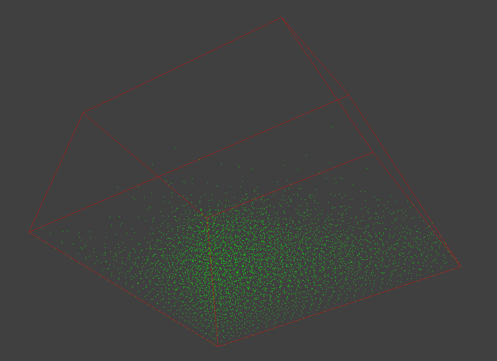

# Smoothed-Particle-Hydrodynamics



##How to build and run

```
cd Smoothed-Particle-Hydrodynamics
mkdir build && cd build && cmake .. && make
Glitter/Glitter
```

##Additional Features:

+ [Arcball Mechanism](http://courses.cms.caltech.edu/cs171/assignments/hw3/hw3-notes/notes-hw3.html)
